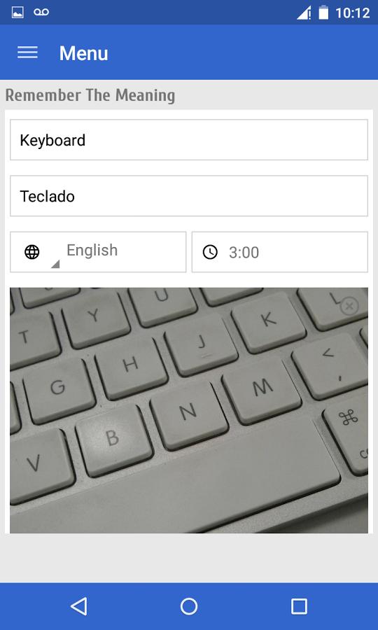
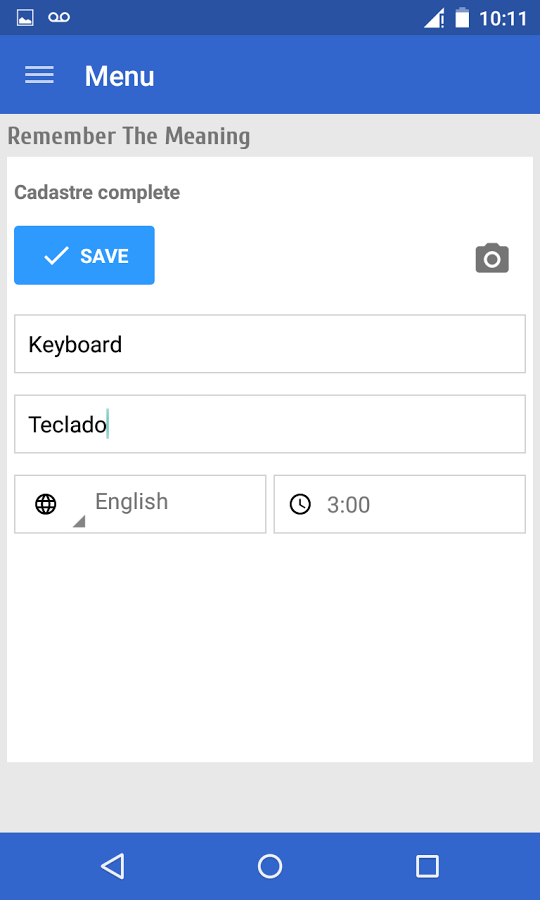
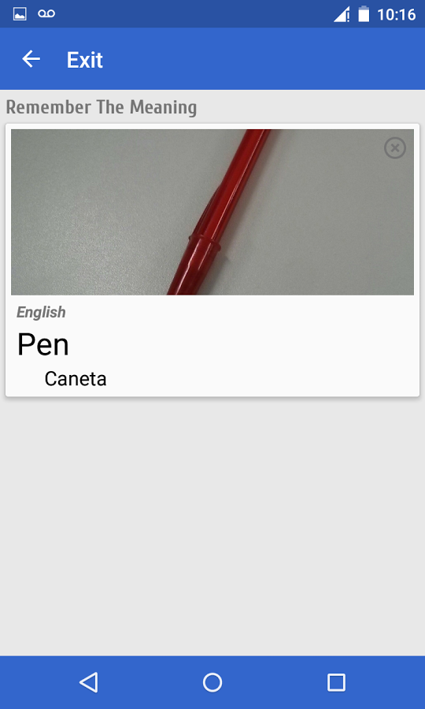
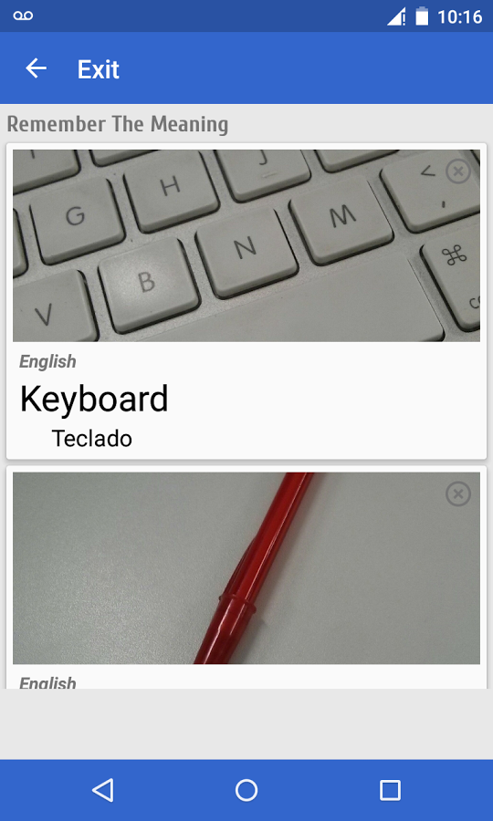
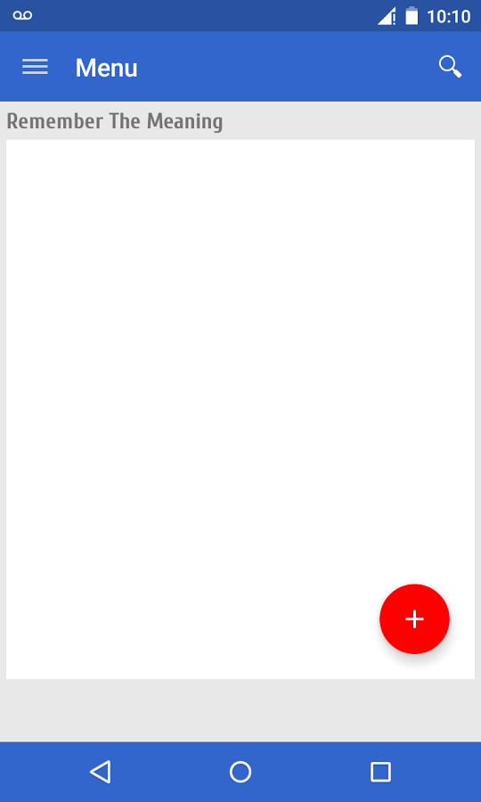
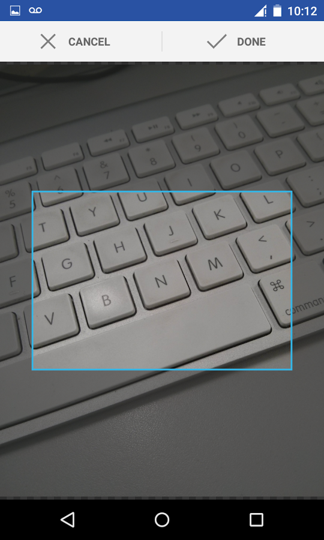

# Remember The Meaning
Remember The Meaning is a simple app, destined for student of languages.

# Download

# What does this app do?
It is an open source Android application that allows register a word and your meaning in the language studied, to define a interval for start to receive noticatications for remember the meaning of word castraded.

# Post blog
Check out the blog post here: http://vlabs.com.br/2017/10/21/remember-the-meaning/

# Screenshots

    
    
    
    
    
    

# Contributions
Contributions for improve the app are welcome. 

# License
Copyright 2017 vlabs

Licensed to the Apache Software Foundation (ASF) under one or more contributor
license agreements. See the NOTICE file distributed with this work for
additional information regarding copyright ownership. The ASF licenses this
file to you under the Apache License, Version 2.0 (the "License"); you may not
use this file except in compliance with the License. You may obtain a copy of
the License at

http://www.apache.org/licenses/LICENSE-2.0

Unless required by applicable law or agreed to in writing, software
distributed under the License is distributed on an "AS IS" BASIS, WITHOUT
WARRANTIES OR CONDITIONS OF ANY KIND, either express or implied. See the
License for the specific language governing permissions and limitations under
the License.